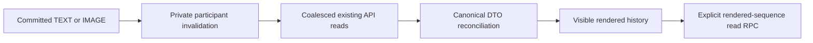

# Messages Phase 3A: Realtime design and migration authoring

2026-10-08. **DESIGNED / AUTHORED. NOT APPLIED. NOT INTEGRATED. STAGING
VERIFICATION PENDING. PRODUCTION UNCHANGED.** Phase 2 checkpoint is `74d832d`;
Phase 1 checkpoint is `65f8dfe`. This phase changes documentation, a new SQL
migration and its local static test only. No hosted project was contacted.
Public documentation research is not a hosted capability test.

This opening records the historical Phase 3A authoring checkpoint. Subsequent
[Phase 3B hosted staging verification](MESSAGES_REALTIME_STAGING_VERIFICATION.md)
applied the unchanged SQL and verified backend authorization/delivery. Frontend
integration was pending at that checkpoint. Subsequent
[Phase 3C integration and browser acceptance](MESSAGES_REALTIME_PHASE3C.md) passed
on staging; production Realtime remains pending. Hosted `realtime.send` adds
an `id` notification UUID to the three application payload fields; this transport
metadata is not a canonical message ID or a persistence acknowledgement.

## Verified baseline and scope

Reviewed [project status](PROJECT_STATUS.md), [TEXT design](MESSAGES_BACKEND_DESIGN.md),
[IMAGE design](MESSAGES_IMAGE_BACKEND_DESIGN.md), [TEXT production rollout](MESSAGES_PHASE1E_B.md),
[Phase 2C](MESSAGES_PHASE2C.md), [Phase 2D](MESSAGES_IMAGE_PHASE2D.md) and
[IMAGE production rollout](MESSAGES_IMAGE_PHASE2E_B.md). Historical design sketches
are not the current contract; this document supersedes the earlier proposed SSE
transport only. Actual Phase 1/2 schema, RPCs and application behavior stay intact.

- [TEXT SQL](../supabase/migrations/202610070001_messages_text.sql) gives immutable
  participants/snapshots, nullable live references, participant SELECT RLS,
  conversation-local locked sequences, idempotent sends and monotone read watermarks.
- [IMAGE SQL](../supabase/migrations/202610070002_messages_images.sql) adds author-only
  reservations/receipts, atomic complete sent manifests, immutable image metadata
  and private Storage. Pending uploads have no message sequence or activity.
- [Repository](../lib/server/supabase-messages-repository.ts) owns canonical DTOs,
  role lists (50 rows plus cursor), history (50 messages plus `nextBefore`), unread
  counts excluding own messages, listing mapping and signed IMAGE presentation.
- [Messages state](../components/home/messages.tsx) merges durable IDs ordered by
  sequence, accepts API-confirmed TEXT/IMAGE sends, guards account/unmount races
  and acknowledges rendered history. [Chat](../components/home/messages-chat.tsx)
  preserves TEXT nonces and IMAGE composer reconciliation.
- [Photos](../components/home/message-photos.tsx) renew authorized five-minute
  URLs before expiry/on failure without intentionally remounting the gallery.
- [Server client](../lib/supabase/server.ts) uses request-scoped `createServerClient`,
  HttpOnly cookies, same-site policy and no-store. [Session provider](../components/listings/marketplace-session.tsx)
  and [Auth API](../pages/api/auth/[action].ts) remain the account-state authority.
  No application browser Supabase client currently exists.

Installed versions, read from local packages: Next.js 12 Pages Router;
`@supabase/ssr` **0.12.7**, `@supabase/supabase-js`, `@supabase/realtime-js` and
`@supabase/auth-js` **2.117.2**. No dependency changes are needed.

Phase 3 adds incoming TEXT/IMAGE, live Buying/Selling preview/order/unread,
visible active-chat history/read behavior, and recovery after missed events.
Typing, presence, online/seen indicators, editing/deletion, push, other product
Realtime, hosted frontend deployment and a custom socket/SSE server are excluded.

## Mechanism decision and publication safety

Choose **Supabase private Broadcast from database triggers**, with a minimal
invalidation payload. Postgres Changes was the preferred candidate: INSERT/UPDATE
subscriptions apply the subscribing user's table SELECT authorization. However,
Supabase documents that DELETE does not enforce the same row authorization and
can disclose identifiers. An outsider can request different event filters;
filtering only INSERT/UPDATE in our UI is not a security boundary. Existing
administrative conversation removal cascades messages. Changing shared publication
flags could affect unrelated tables; replica identity FULL would add old-row
exposure without fixing this issue. This is the concrete privacy reason to use
the permitted alternative. See [Postgres Changes limitations](https://supabase.com/docs/guides/realtime/postgres-changes).

Private Broadcast permits an authorized receive-only user topic and server-derived
recipients, without publishing message rows. Its hosted primitive `realtime.send`
can send a small JSON signal; private flags must match on server/client. See
[database Broadcast](https://supabase.com/docs/guides/realtime/broadcast) and
[database change subscriptions](https://supabase.com/docs/guides/realtime/subscribing-to-database-changes).
This is an application design choice, not a claim that live hosted configuration
has been verified in Phase 3A.

New migration: [202610080001_messages_realtime.sql](../supabase/migrations/202610080001_messages_realtime.sql).
**AUTHORED ONLY.** No `ALTER PUBLICATION`, table publication membership, replica
identity change, replication slot, application table/RPC replacement or Storage
change. `conversations`, `messages`, `message_images` and upload reservations are
not added to `supabase_realtime`. The managed Broadcast transport handles its own
`realtime.messages` infrastructure; the app does not configure a custom publication.

The migration adds two private definer notification functions, two AFTER triggers,
one authenticated receive policy and four restrictive namespace fences on
`realtime.messages` (read, insert, update, delete). Only its own named objects are
replaced on retry. Existing application RLS, policies, grants and Phase 1/2 triggers
remain. Search paths are empty; trigger helper execution is revoked from PUBLIC,
anon, authenticated and service_role. Trigger execution is not a browser RPC.

Preflight stops if `realtime.send(jsonb,text,text,boolean)`, `realtime.topic()`,
platform RLS or existing authenticated SELECT support is missing, or messaging
tables unexpectedly belong to `supabase_realtime`. It does not silently repair
managed internals, grants or existing publication membership. These are Phase 3B
hosted inspection gates. Private-channel availability/project limits and any
Dashboard Realtime enablement cannot be established from repository source; verify
them there, with separate authorization. No Dashboard change is prescribed now.

Notifications are transactional DB rows, not HTTP calls inside send RPCs; a rolled
back IMAGE/TEXT transaction must not produce a durable notification. Emission
errors are caught in the optional trigger block with SQLSTATE-only diagnostics;
ordinary notification failures must not turn a committed send into UI failure.
Normal DB cancellation/fatal transaction errors still follow PostgreSQL behavior.
No exactly-once delivery, replay guarantee or custom durable event log is promised.
Hosted tests must verify commit/rollback and fault behavior, not infer it from SQL.

## Privacy and signal contract

Topic: `marketplace:messages:<authenticated user UUID>`, always `private:true`.
The topic name is not a secret. SELECT authorization requires its exact owner,
current verified Western eligibility, Broadcast extension and matching
`realtime.topic()`. A restrictive fence protects the reserved namespace even if
another broad permissive policy exists. Anonymous/outsider receive and all client
publish/update/delete are denied there. Unrelated topic namespaces retain their
existing policies. Do not grant browser trigger-helper execution or introduce a
service-role client.

Each trigger derives recipients from current buyer/seller columns and verifies
recipient eligibility against `auth.users`; no browser-supplied identity/topic
participates. Removed/null/unverified participants receive no subsequent signals,
even if they previously joined a channel. For a messages INSERT, send `scope=history`
to both surviving participants. Conversation INSERT or activity/membership/live-FK
change sends `scope=list` to both. A read-watermark-only UPDATE sends list invalidation
only to the reader. Updated-at-only writes produce no signal. No DELETE subscription
or deletion trigger is installed; administrative disappearance is recovered via APIs.

Event `messages_changed` payload has only:

```json
{ "conversationId": "<durable UUID>", "role": "buying", "scope": "history" }
```

`role` is buying/selling for the recipient, `scope` is history/list. No message
content, sender, image metadata/path/URL, watermark, unread integer, email, token
or secret. Existing message rows are never broadcast verbatim. The platform may
retain transient Broadcast records; this is not application history or replay.
Diagnostics retain only event/request counts, statuses and lifecycle generations.

Private Broadcast authorization is distinct from Postgres Changes row RLS and is
evaluated at join/token update, with connection caching. Current-recipient emission
plus current API RLS provide the privacy boundary; callbacks alone do not. See
[Realtime authorization](https://supabase.com/docs/guides/realtime/authorization).
Logout removes channels and token memory immediately in our client. A copied
valid access JWT remains a bearer capability until expiry; do not promise global
instant token revocation. Never return a refresh token to the browser bridge.

## Minimal browser client and existing-session bridge

The preferred installed SSR browser helper manages its own cookies through
`document.cookie`; supplied `auth.storage` is ignored and browser refresh is enabled
by default. It cannot read this app's HttpOnly session and would require changing
cookie visibility or creating competing session storage/refresh. Those changes
are rejected. This compatibility finding comes from local
`node_modules/@supabase/ssr/src/createBrowserClient.ts` and [SSR cookie guidance](https://supabase.com/docs/guides/auth/server-side/advanced-guide).

Design a lazy browser-only `@supabase/supabase-js createClient` with public
`NEXT_PUBLIC_SUPABASE_URL` / `NEXT_PUBLIC_SUPABASE_ANON_KEY`, stable for the current
project/account generation. Use its supported `accessToken` callback to obtain
the user's existing authenticated JWT, held only in a closure. In the installed
SupabaseClient implementation, supplying this callback bypasses construction of
the browser Auth client; `.auth` methods are unavailable. Its Realtime callback
mode refreshes tokens on connect/heartbeat. See the [official SDK source](https://github.com/supabase/supabase-js/blob/master/packages/core/supabase-js/src/SupabaseClient.ts);
local installed source, rather than current documentation examples, governs APIs.
Use an in-memory Realtime `sessionStorage` adapter too. No localStorage, persisted
session, `setSession`, login, refresh-token SDK call or URL recovery detection.

Future narrow `POST /api/messages/realtime-session` (not implemented here):

1. Existing same-origin/custom-header write guard; no CORS permission. Private,
   no-store, no-referrer response; request/response bodies excluded from diagnostics.
   Add it to the existing Messages PWA NetworkOnly scope, not a new cache.
2. Use existing exact APP_ENV/project/public-key guard, normal request-scoped SSR
   client and `requireMarketplaceUser`. The server remains sole refresh authority
   and may propagate refreshed HttpOnly Set-Cookie headers through existing helper.
3. Only after verified identity, read the current session. Require matching user
   ID, authenticated role, expected project issuer and unexpired access JWT.
   Never treat unverified `getSession` data alone as authentication. Return only
   `{accessToken, expiresAt, userId}` for that verified current session. No cookie
   values, refresh token, profile, service-role key or general token-minting RPC.
4. Browser checks returned account against existing MarketplaceSessionProvider,
   caches until the refresh margin (60 seconds), shares one in-flight bootstrap
   and discards late responses after account/logout/unmount generations change.
   Realtime uses the supplied user JWT; request/response API DTOs remain cookie-authenticated.
5. Refresh on expiry margin, subscription recovery and visible/online resume;
   when needed call `realtime.setAuth()` in callback mode before rejoin. Never fall
   back to subscribing as anon. On 401/403 or account mismatch, close channel,
   clear token and use the existing session refresh/navigation flow.

This intentionally exposes a short-lived **user access token** to JavaScript for
the authenticated socket, increasing the consequence of XSS compared with API-only
HttpOnly sessions. It does not expose the privileged server key or refresh cookie.
Implement/test the bridge only in the later authorized integration phase; do not
silently alter cookies or the existing login, OTP, logout and recovery handlers.
Bind cleanup to the existing account/session provider. A small credential-free
same-origin logout/account-change notification may supplement immediate same-tab
teardown and cross-tab cleanup later; it carries no token and creates no second
Auth provider. Focus/resume always revalidates server session before reusing caches.

## Subscription strategy and channel lifecycle

**One private channel per signed-in Messages tab, independent of conversation count.**
One `messages_changed` listener serves both roles and active history. With several
Buying and Selling conversations plus one open chat, count remains one channel /
one listener / one socket on the lazy stable client. Zero channels while signed out
or outside Messages. No per-conversation/list channels, Presence or client send.

- Buying: `role=buying` dirties Buying's canonical list; Selling similarly. Keep
  both bounded first-page caches current while Messages is mounted, even if one
  role is hidden. Switching roles schedules a fresh selected-role list read.
- Active chat: a history signal only invalidates history when its conversation
  equals the current visible selected chat. Other history signals dirty that
  role's list. An active conversation list signal can also schedule history so
  dropped paired message signals do not block catching up.
- Desktop chat visibility is the selected open chat; mobile Go Back means history
  inactive even if its component remains mounted. Attachment overlay, hidden
  document or obscured chat pauses rendered acknowledgments. Tab background can
  pause/remove the channel; foreground establishes it then reconciles.

| Transition | Required action |
| --- | --- |
| Messages mounts with verified account | Bootstrap token, install one listener, join private channel, reconcile after SUBSCRIBED |
| Buying/Selling changes | Retain channel, advance view generation, clear old view timers, refresh selected list; no listener addition |
| Conversation changes | Advance history generation, invalidate old work, reconcile new conversation; channel remains one |
| Mobile Go Back | Clear active-history timer/ack observer; retain list feed; hidden chat cannot mark read |
| Leave Messages / component unmount | Invalidate generation first, clear timers/listeners/observers, abort or ignore fetches, await removeChannel then disconnect owned idle client, clear token |
| Logout / account/project changes | Synchronous callback gate before teardown, discard all prior account DTOs/URLs/token, remove old channel before new account join |
| Resume / reconnect / refreshed user JWT | Revalidate session, authorize/rejoin as needed, then refresh both lists and active history |

Do not create a client during SSR or speculative hidden renders. React Strict Mode
mount/cleanup/remount must serialize teardown/join and never leave two active
channels. If desktop/mobile instances coexist, only the visible Messages owner
acquires the tab controller; test mount topology. Generation checks are mandatory
even where existing fetch wrappers lack AbortSignal. Late API persistence responses
may update the originating same-account conversation cache, never the newly selected
conversation's UI or read boundary. Do not cancel a possibly committed send on switch.

## Canonical reconciliation, TEXT, IMAGE and dedupe



Realtime only dirties scopes. Existing [Messages API client](../lib/messages-api.ts)
returns authority for message IDs, sequence/time/type/content, ordered IMAGE DTOs,
signed URLs, list preview/order/unread, watermarks, authorization and live/snapshot
listing mapping. No event payload is appended as a bubble or durable list row.

TEXT send response and IMAGE finalize response remain immediately accepted canonical
messages, independent of socket status. Preserve existing stable TEXT nonce and IMAGE
submission/client nonce on ambiguous response retries. Own echoes trigger the same
refresh path; do not skip all own events, as another tab may have sent a message.
Merge by durable message ID, check conversation-local sequence uniqueness, order by
sequence, and use client/submission nonce only to reconcile the same send intent.
Conflicting durable ID/sequence is an invariant error that forces fresh API state,
never two bubbles or a timing heuristic. No local preview double increment or
unread self increment; only authoritative list/detail DTOs replace those fields.

Preserve existing objects/React keys when durable fields are unchanged. For IMAGE,
compare immutable attachment identity/order/metadata separately from signed URL
expiry. Retain the newer still-authorized URL lease when an older request completes;
discard expired leases and request normal signing renewal. Scope every URL result
to account/message/generation. Never build public Storage URLs from an event or
store paths/URLs in Realtime payloads. Atomic IMAGE finalize commits children with
the parent, so subsequent history APIs can assemble the complete gallery. A temporary
signing/presentation error keeps already displayed canonical data and retries API
presentation; it cannot undo the committed IMAGE or justify canceling its upload.

### Pagination and missed bursts

Latest history API returns 50 ascending-presented messages with a backward cursor,
not an `after` endpoint. A one-page merge cannot heal an arbitrarily large missed
gap. Capture the newest canonical horizon, walk `nextBefore` backwards until the
prior loaded range overlaps, then ID/sequence merge. Messages newer than that horizon
mark the scope dirty for a trailing refresh. At most five 50-row pages per catch-up
cycle, sequential within that scope; never an unbounded fetch loop.

If a gap still exceeds that cap, retain the upward-scrolled old viewport and offer
the minimal new-messages/jump-to-latest action. On jump (or when already following
the bottom), render the authoritative newest page and reset the existing older-page
cursor to that page, rather than joining disjoint ranges as if contiguous. Normal
Load Older can recover the full gap. Cursor for old-history expansion remains separate
from latest refresh until a deliberate reset. No custom event log or API redesign.
Tests must exercise both >50 and >250 missed messages and overlap with local sends.

Role-list invalidation starts at the canonical first page, resetting stale activity
cursors because sends can move rows between pages. Do not combine a new first page
with an unvalidated old tail and claim complete live ordering. Reset the affected
role's paginated collection/cursor, retain selection by UUID and obtain selected
detail separately if outside that page. Existing Load More retrieves subsequent
canonical pages and deduplicates IDs. This bounds automatic refresh at 50 rows per
role; selection must not jump because sorting moves a row. Snapshot/live listing
availability is refreshed through these APIs, not a listings subscription.

## Scroll and rendered read watermarks

Current [history renderer](../components/home/message-history.tsx) scrolls to the
bottom whenever the last ID changes and reports the highest DOM-rendered sequence.
That is insufficient for background incoming updates while a user reads older
messages. A later small renderer change is required, not implemented here.

- Record whether the viewport was within 80px of the bottom **before** applying
  new history. Initially opening a conversation and confirmed own sends retain
  the existing latest-message behavior. Incoming updates follow the bottom only
  when the user was already following it.
- If scrolled upward, preserve the first visible durable bubble and pixel offset;
  prepend/late image layout changes preserve that anchor. Show one minimal
  New messages / jump-to-latest affordance, not a new toolbar or socket-status UI.
  Signed URL replacement for the same bubble must not cause scrolling/remounting.
- Only after canonical history commits and bubbles/gallery containers render in
  the visible, active, unobscured history viewport can the watermark advance.
  Use viewport visibility/paint confirmation to bound the highest actually shown
  sequence. New tail rows below an upward-scrolled viewport are not automatically
  acknowledged merely because they exist in the DOM. Image decoding/renewal remains
  independent; the visible durable IMAGE bubble, not network event arrival, is the
  acknowledgment boundary.
- `readConversation(id, throughSequence)` remains monotone and scoped to the captured
  conversation/account. One in-flight read per conversation, max pending rendered
  boundary, no repeated request for an already acknowledged sequence. Only confirmed
  responses update the acknowledgment cache. Failed reads retry without regressing
  the database watermark. Own successful sends retain the approved Phase 1 automatic
  sender acknowledgment; Realtime must not change that rule.
- After a read response, schedule canonical role-list refresh: a stale read-count
  response can race a newly committed incoming message. Do not overwrite newer
  preview/activity/unread DTOs with that old response. If message N+1 arrives while
  N is acknowledged, N+1 remains unread until actually rendered and acknowledged.
  Reading one conversation cannot clear another. No seen/read-receipt UI is added.

## Coalescing, races, recovery and failure fallback

Use a small tab controller with dirty scopes `buying`, `selling`, `activeHistory`;
one 100ms batching timer (non-resetting deadline prevents starvation), one in-flight
job per scope and at most two concurrent API jobs. Events received during a request
set a dirty bit; its completion schedules one trailing pass. Latest request revision
and account/view/history generation gate application of results. Catch-up pages and
normal older-page reads use separate cursors but the same reconciliation gate.
Constant-size dirty flags replace accumulating event queues. These are design
bounds, not measured hosted performance or an N+1 query optimization.

| Race | Resolution |
| --- | --- |
| A: API send response before echo | Merge confirmed DTO once; later refresh reuses ID/sequence/object identity |
| B: Echo before send response | API refresh may show committed DTO first; response merges that same durable row |
| C: Rapid incoming messages | Dirty scopes coalesce; trailing read fetches newest committed horizon, pagination heals gaps |
| D: TEXT and IMAGE close together | Order canonical sequences, never socket arrival/type; IMAGE DTO comes from signed history |
| E: Read versus new arrival | Explicit rendered boundary and monotone DB RPC; list invalidation follows response |
| F: Conversation/account switch | Old generations cannot update current history, selection or acknowledgment; same-account confirmed send belongs to origin cache |
| G: Signing renewal versus history | Match durable image IDs; retain fresher lease, stable keys/gallery state; ignore stale/account-old results |

Every SUBSCRIBED (initial and reconnect), foreground/online resume and session
refresh schedules canonical list(s) plus visible active-history reconciliation,
after session validity. Subscribe first, then fetch; signals during that fetch
mark dirty, closing the subscribe/fetch gap. Do not rely on SDK resubscription to
replay missed events. Laptop wake and offline/online collapse to one recovery pass.

On CHANNEL_ERROR/TIMED_OUT/CLOSED or heartbeat failure, mark internal health,
coalesce session revalidation/rejoin with exponential bounded retry (1/2/4/8/16/30s
with jitter); stop retries hidden/offline/unmounted. During degraded Realtime,
visible Messages can perform one bounded canonical recovery refresh per 30s as a
fallback, using the same controller. Also refresh on user navigation/retry; manual
Reload still works. When subscribed again cancel degraded timer. No server worker,
custom socket server, Redis or new state library. Optional signal failure never
decides persistence success; TEXT/IMAGE sends, open/read/history and existing
retry controls continue through APIs. No prominent online/offline or fake send
failure based on socket status.

Small later helpers: generation-aware scheduler with injected clock/API, canonical
message merge with immutable identity/URL-lease comparison, and lifecycle owner
with injected channel adapter. Test event permutations, in-flight dirty flags,
bounded retries and teardown with fake clocks/deferred promises; avoid fragile
sleep-only assertions or mocking RLS as hosted proof. No helpers are implemented
in Phase 3A.

## Phase 3B hosted staging plan and Phase 3C frontend acceptance

**Plan only; not executed.** Staging target is western-marketplace-staging
`pcaqxezdfxofysghssyo`; production `yzvchumzyonegujucyqs` must be blocked by the
later harness. Use disposable real verified Seller A, Buyer B and Outsider C,
plus a conversation where an existing test participant takes the opposite role.
Independent browser/cookie contexts; normal listing publish / Contact Seller,
normal TEXT sends and real decodable JPEG/PNG/WebP Files through the Phase 2 UI.
No personal photos, production data or primary DB-direct IMAGE fixtures.

Phase 3B verifies migration/capabilities and real private subscriptions via a narrow
staging-only harness. It cannot claim final UI behavior before Phase 3C implements
the controller/bridge/renderer changes. Both stages need separate authorization.

| Stage/check | Acceptance evidence |
| --- | --- |
| B: Preflight/publications | Pin target; inspect RLS, grants, function signatures, private-channel support/limits and publication membership. Stop on collision; no global publication flag repair. Dry-run proposes only 202610080001; apply normal migration workflow only after approval. |
| B: Catalog and repeat safety | Verify exactly new functions/triggers/policies, empty search paths/helper revokes, unchanged Phase 1/2 bodies/constraints/grants/Storage; new-name reauthor retry exercised safely on disposable staging only if authorized. |
| B: Real sessions/privacy | Buyer/Seller receive own private topics. Outsider/anon/wrong JWT project and another user's topic are denied, including an unfiltered request and public-channel attempt. No content/path/URL in payload. |
| B: Namespace fences | Attempt client Broadcast sends and direct insert/update/delete with existing broad policies; cannot forge/move/read another user's signals. Check auth-query join probes still support receive-only subscriptions. |
| B: Actual events | Committed TEXT and 1/4-image finalize emit invalidations; pending prepare/upload/receipt/cancel do not. Rollback emits no committed message. Read-only watermark change signals reader only. Lost finalize/retry may refetch but creates no second durable message. |
| B: Recipient removal | Remove only disposable profile/eligibility after listing cleanup as required; even a previously joined topic receives no subsequent conversation signals. Surviving participant keeps history. |
| B: Failure fallback | Scoped staging fault injection makes notification emission fail; valid API send still persists once, subsequent canonical recovery shows it. Do not disable production or platform Realtime globally. |
| C: Session bridge | Existing login/OTP/recovery/logout unchanged; HttpOnly retained, no refresh/server key returned, memory-only access JWT, token expiry refresh/rejoin and wrong-account response discarded. Fresh client-bundle secret scan. |
| C: Incoming live TEXT/IMAGE | Independent recipient UI updates without reload; assert durable IDs/sequences, images decode from authorized URLs; no public URL construction. Await event/request/render evidence, not a fixed sleep. |
| C: Echo and race A-G | API-first and event-first permutations, ambiguous TEXT/finalize response retry, fast repeated sends, mixed concurrent TEXT/IMAGE: one bubble/sequence each, no unread self increment or preview double change. |
| C: Live lists and roles | Several Buying and Selling conversations, new conversation INSERT, inactive-role updates, activity reorder/preview/unread; selected chat UUID stays selected; pagination reset and selected-outside-first-page behavior verified. |
| C: Render/read/scroll | Following bottom follows incoming; upward scroll anchor survives, new-tail unread retained until shown, hidden/mobile-back/attachment-overlay chat does not acknowledge. Read race N/N+1 and unrelated conversation unread preserved. |
| C: Recovery | Drop WebSocket/network, laptop-style suspend, tab resume, token refresh and browser offline/online. Heal both lists/history, including >50 and >250 missed messages with correct older cursor and no silent gaps. |
| C: Lifecycle/channel count | Repeated Buying/Selling/conversation switches, Go Back, navigation away, logout/account change and Strict Mode: <=1 active channel per Messages tab; zero outside/logout; no stale callbacks or accumulating timers/listeners. |
| C: Signed IMAGE renewal | Real authorized renewal and expired/failed display paths race with history; stable gallery expansion/scroll, fresh leases and outsider denial; no signing query/token logs or PWA private cache. |
| C: Listing lifecycle | Sold and separately deleted disposable listing retain conversation, TEXT/IMAGE receive/signing and graceful View Listing, without listing subscriptions. |
| C: Realtime unavailable | WebSocket blocked locally while server APIs work: TEXT/IMAGE persists, opens/history/navigation/manual retry/degraded recovery work; no fake persistence error or prominent status UI. |
| C: Responsive regression | 390/430/1280/1536: empty/populated Buying/Selling, unread, chat scrolling, composer/attachments, gallery and mobile Back; no overflow/redesign. |
| B/C: Cleanup and report | Delete disposable conversations/data; remove Storage through supported API and settle queues/receipts; remove listing/profile/Auth fixtures and temporary local files/cookies/keys. Verify zero residue. Keep only applied staging migration/platform transport setup and source/docs/tests. Report exact measured channels/API counts, limitations and no production contact. |

Measure bursts using harmless internal counts: 20 closely grouped invalidations
should batch scopes and produce at most one running plus one trailing job per
scope, not 20 parallel reads. With 1, 5 and many conversations, channel count stays
one. Actual list DTO queries still have the existing bounded N+1 cost; performance
claims require staging measurement, not guessed socket throughput.

## Phase 3A validation and boundaries

Local [static contract test](../tests/messages-realtime-migration.cjs) checks the
new security/trigger/signal boundaries and original migration hashes. It is not
SQL execution, hosted RLS authorization, Broadcast compatibility, transactional
delivery or frontend behavior proof. Run only TypeScript, focused new-test ESLint,
existing local TEXT/IMAGE API/environment/selection/presentation/state tests,
Phase 1/2/3 migration static suites, local documentation links and diff checks.
No build, hosted lint, CLI dry-run/push, database query, Dashboard visit, fixture
creation or final frontend subscription integration is performed in Phase 3A.

Completed local validation: TypeScript `--noEmit --incremental false`, focused
ESLint on the new static test, all eight local Messages/API/environment,
selection/presentation/state and migration suites, **173 local links across 22
Markdown files**, and `git diff --check` pass. No SQL parser/execution or hosted
capability verification is claimed. The pre-existing GlideSelect.jsx global lint
parserServices debt remains unchanged; only focused lint was requested/run.

PHASE 1 TEXT BASELINE UNCHANGED. PHASE 2 IMAGE BASELINE UNCHANGED.
REALTIME MIGRATION: AUTHORED ONLY. STAGING NOT MODIFIED. PRODUCTION NOT MODIFIED.
NO COMMIT. NO PUSH.
